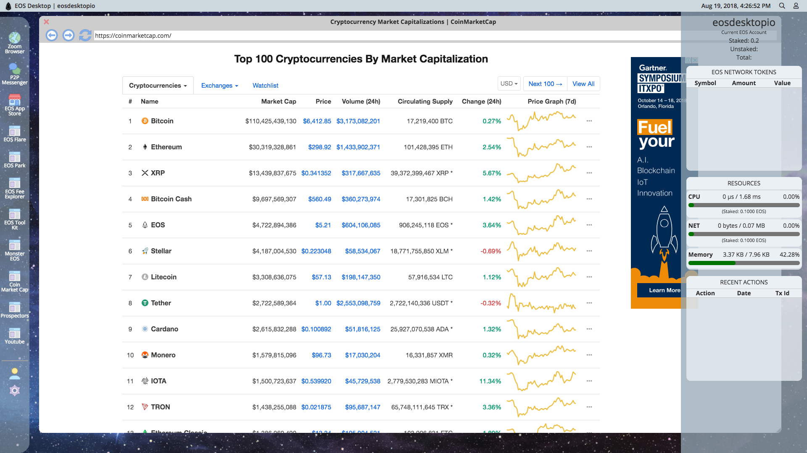

# EOS Desktop
Every operating system needs a GUI! EOS Desktop is a Angular/Electron based Desktop GUI designed to allow
users to enter a fully integrated EOS Network environment. All the best EOS and crypto-currency websites in only place.
Users can easily access EOS Network based Dapps from the EOS Desktop. Additionally, in the future, EOS Desktop will be have its own native applications. 
EOS Desktop currently has a basic web-browser (no tracking) and ability to host any web Dapp.

 

## Contribute
Building EOS Desktop takes a lot of hard work and time. If you want to contribute 
to the development of EOS Desktop you can send EOS to account name: `eosdesktopio`.

## Scatter Integration
EOS Desktop uses Scatter Desktop to load your identity details. 
EOS Desktop never has access to your private keys, and at this stage in development only asks for your identity. 
It does not perform any EOS network operations on your accounts. 

## Get Started
Clone the Repository and run `npm install` and `npm run electron-build` to start the application. Maximize window for best user experience. 

## Releases
Pre-Alpha Release coming soon....

