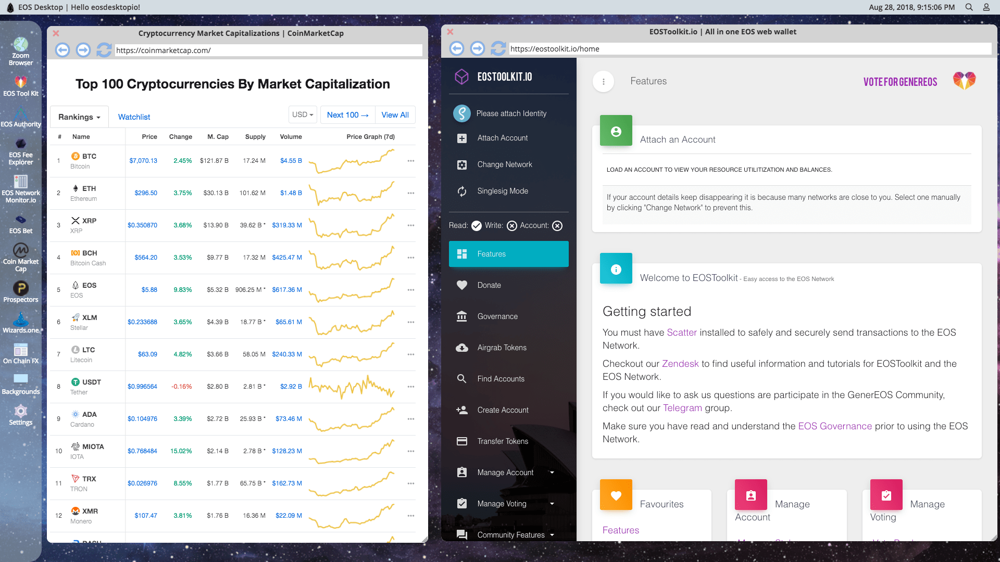

# EOS Desktop
Every operating system needs a GUI! EOS Desktop is a Angular/Electron based Desktop GUI designed to allow
users to enter a fully integrated EOS Network environment. All the best EOS and crypto-currency websites in only place.
Users can easily access EOS Network based Dapps from the EOS Desktop. Additionally, in the future, EOS Desktop will be have its own native applications. 
EOS Desktop currently has a basic web-browser (no tracking) and ability to host any web Dapp.

 

## Support
Building EOS Desktop takes a lot of hard work and time. If you want to support 
to the development of EOS Desktop you can send EOS to account name: `eosdesktopio`.

## Scatter Integration
EOS Desktop uses Scatter Desktop to load your identity details. 
EOS Desktop never has access to your private keys, and at this stage in development only asks for your identity. 
It does not perform any EOS network operations on your accounts. 

## Get Started
Clone the Repository and run `npm install` and `npm run electron-build` to start the application. Maximize window for best user experience. 

## General Safety
Never put your private keys into EOS Desktop, the browser search bar, 
or any site that you navigate to.

## Releases
Pre-Alpha Release coming soon....

## License and Copyright
 Copyright 2018, Errick Benson Peart

Licensed under the Apache License, Version 2.0 (the "License");
you may not use this application except in compliance with the License.
You may obtain a copy of the License at

http://www.apache.org/licenses/LICENSE-2.0

Unless required by applicable law or agreed to in writing, software
distributed under the License is distributed on an "AS IS" BASIS,
WITHOUT WARRANTIES OR CONDITIONS OF ANY KIND, either express or implied.
See the License for the specific language governing permissions and
limitations under the License.
