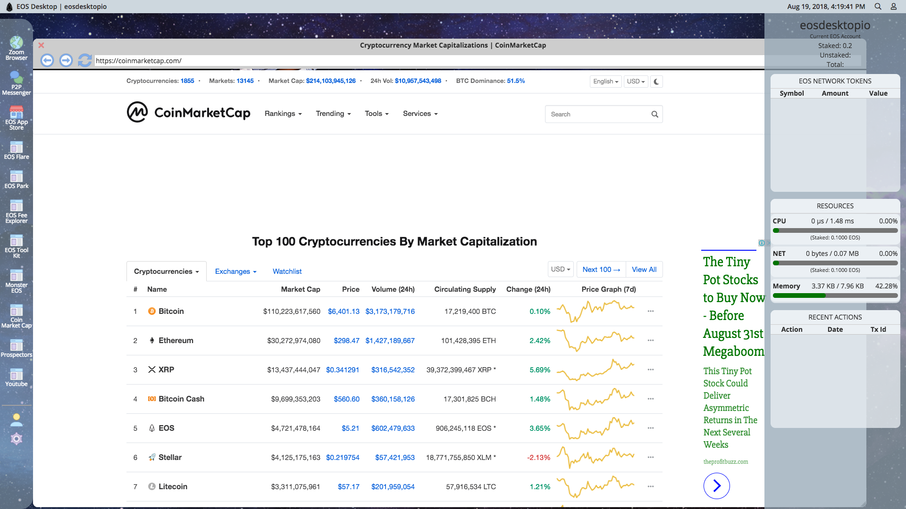

# EOS Desktop
EOS Desktop is a Javascript based Desktop GUI designed to allow
users to enter a fully integrated EOS Network environment. Users can easily access EOS Network based Dapps 
from the EOS Desktop. Additionally, in the future, EOS Desktop will be have its own native applications. 
EOS Desktop currently has a basic web-browser and ability to host any web Dapp. 

## Get Started
Clone the Repository and run `npm install` and `npm run electron-build` to start the application. Maximize window for best user experience. 

## Contribute
Building EOS Desktop takes a lot of hard work and time. If you want to see contribute 
to the development of EOS Desktop you can send EOS to account name: `eosdesktopio`.
